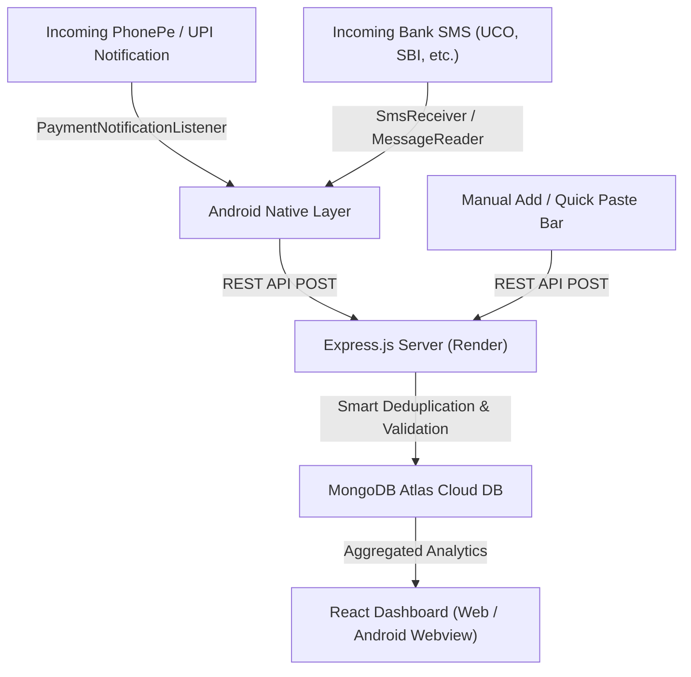

# 💳 Spendly — Smart Personal Expense & UPI Tracker

<div align="center">


[](https://react.dev/)
[](https://tailwindcss.com/)
[](https://capacitorjs.com/)
[](https://nodejs.org/)
[](https://www.mongodb.com/atlas)
[](https://spendly-9qw5.onrender.com)

**Automated, zero-effort expense tracking engineered for Indian digital payments.**  
Ingests and categorizes PhonePe, Google Pay, Paytm, and bank UPI alerts (UCO Bank, SBI, HDFC, ICICI, etc.) with real-time sync, smart cross-source deduplication, and rich interactive analytics.

[Live API Server](https://spendly-9qw5.onrender.com) • [API Health Check](https://spendly-9qw5.onrender.com/api/health) • [Download APK](Spendly.apk)

</div>

---

## 🌟 Key Features

### 1. ⚡ Zero-Manual Automatic Expense Tracking
* **Native Android SMS Interception**: Background `SmsReceiver` catches debits and credits from Indian banks (e.g. UCO Bank, SBI, HDFC, ICICI) the instant an SMS arrives.
* **PhonePe & UPI Push Notification Listener**: Android `NotificationListenerService` captures transaction notifications from PhonePe, Google Pay, and Paytm even when the bank does not trigger an SMS.
* **Historical Inbox Sync**: One-tap native sync reads past bank SMS messages and populates your full expense history.

### 2. 🛡️ Smart Deduplication & Spam Protection
* **10-Minute Cross-Source Window**: When you pay with PhonePe, both a push notification and a bank SMS arrive. Spendly detects matching amounts and timestamps within 10 minutes and links them into a **single transaction** instead of charging you twice.
* **Accurate Credit vs. Debit Logic**: Correctly differentiates peer-to-peer transfers (e.g., *"Money received: GUNJAN has sent ₹160 to your bank account"* is classified as **INCOME**, not an expense).
* **Promo & Marketing Filter**: Automatically rejects spam (cashback offers, coupons, recharge discounts) so they never pollute your financial data.

### 3. 📊 100% Real-Data Analytics & Dashboard
* **No Mock/Placeholder Data**: All metrics, monthly bars, and donut charts are aggregated dynamically from MongoDB Atlas.
* **Dynamic Metric Cards**: Real-time Total Expenses, Total Income, Daily Average Spend, and PhonePe-specific totals.
* **Interactive Calendar**: Automatically highlights active spending days with exact daily expenditure pills.
* **Category Breakdown**: Automatically categorizes transactions into Food & Dining, Shopping, Transportation, Bills & Utilities, UPI Transfers, and Income.

### 4. 📱 Hybrid Web & Native Android Packaging
* Runs seamlessly as a modern web app in the browser and packages into a native Android APK via **Capacitor**.
* Includes runtime permission prompts for SMS and Notification Access upon first launch.
* In-app click-to-edit username with `localStorage` persistence.

---

## 🏗️ Architecture & Data Flow



---

## 📁 Project Structure

```
Expense-Tracker/
│
├── Spendly.apk                           # Pre-compiled, installable Android APK (~4MB)
├── Personal_Expenses_Tracker_Guide.docx  # Architecture blueprint & implementation guide
├── package.json                          # Workspace configuration
│
├── backend/                              # Express.js REST API & Database layer
│   ├── config/
│   │   └── db.js                         # Mongoose MongoDB Atlas connection
│   ├── controllers/
│   │   └── transactionController.js      # CRUD, deduplication, promo filter & analytics
│   ├── models/
│   │   └── Transaction.js                # Transaction schema with indexing
│   ├── routes/
│   │   └── transactionRoutes.js          # API endpoints (/transactions, /analytics, /cleanup)
│   ├── .env                              # Port & live MongoDB connection URI
│   ├── package.json                      # Backend dependencies (express, mongoose, cors, dotenv)
│   └── server.js                         # Express entrypoint with status landing page
│
└── frontend/                             # React 19 + Tailwind CSS + Capacitor Android
    ├── android/                          # Native Android Studio project
    │   └── app/src/main/
    │       ├── AndroidManifest.xml       # SMS & Notification Listener declarations
    │       └── java/.../expensetracker/
    │           ├── MainActivity.java     # Permission handlers & Capacitor bridge
    │           ├── SmsReceiver.java      # Background broadcast receiver for bank SMS
    │           └── PaymentNotificationListener.java # Background push notification listener
    ├── src/
    │   ├── components/
    │   │   ├── Header.jsx                # Date, editable username, sync & export triggers
    │   │   ├── MetricCards.jsx           # Total Expense, Income, Daily Avg, PhonePe cards
    │   │   ├── SpendingChart.jsx         # Monthly expense breakdown bar chart
    │   │   ├── CalendarCard.jsx          # Interactive monthly calendar with spend highlights
    │   │   ├── CategoryDonut.jsx         # Visual category breakdown donut
    │   │   ├── TransactionList.jsx       # Real-time transaction history with delete
    │   │   ├── SmsSyncModal.jsx          # Device SMS sync & manual tester modal
    │   │   ├── AddExpenseModal.jsx       # Manual expense entry form
    │   │   ├── Sidebar.jsx               # Desktop navigation & branding
    │   │   └── MobileNav.jsx             # Bottom navigation for mobile screens
    │   ├── services/
    │   │   ├── api.js                    # REST API client (points to Render cloud backend)
    │   │   ├── parser.js                 # High-precision Indian SMS & UPI regex parser
    │   │   └── smsService.js             # Capacitor native SMS reader interface
    │   ├── App.jsx                       # Main dashboard state & auto-sync loop
    │   └── main.jsx                      # React application bootstrap
    ├── capacitor.config.json             # Capacitor app ID & web asset config
    ├── tailwind.config.js                # Custom palette & neo-morphic styles
    └── vite.config.js                    # Vite bundler configuration
```

---

## 🛠️ Technology Stack

| Layer | Technology |
| :--- | :--- |
| **Frontend Framework** | React 19, Vite 8 |
| **Styling & UI** | Tailwind CSS v3, Lucide Icons, Canvas Confetti |
| **Mobile Runtime** | Capacitor 6 (`@capacitor/android`, `@solimanware/capacitor-sms-reader`) |
| **Native Android** | Java, Android SDK 34, `NotificationListenerService`, `BroadcastReceiver` |
| **Backend Framework** | Node.js, Express.js 5 |
| **Database** | MongoDB Atlas (Mongoose ODM) |
| **Deployment** | Render (Web Service), GitHub Actions |

---

## 🚀 Getting Started

### Prerequisites
* **Node.js**: v18.0.0 or higher
* **Java Development Kit (JDK)**: JDK 17 or Android Studio JBR
* **Android Studio**: (Only required if compiling native code or running on emulator)
* **MongoDB Atlas Account**: (Or local MongoDB instance)

---

### 1. Backend Setup

```bash
cd backend
npm install
```

Create or verify `backend/.env`:
```env
PORT=5000
MONGODB_URI=your_mongodb_connection_string
```

Run the backend locally:
```bash
npm start
# API starts at http://localhost:5000
```

---

### 2. Frontend Setup

```bash
cd frontend
npm install
```

Start the Vite development server:
```bash
npm run dev
# Dashboard opens at http://localhost:5173
```

To point the frontend to your local backend instead of Render, create `frontend/.env`:
```env
VITE_API_URL=http://localhost:5000/api
```

---

### 3. Android Mobile Build & USB Debugging

#### Option A: Direct Install Pre-compiled APK
If your phone is connected via USB with **USB Debugging** enabled:
```powershell
adb install -r Spendly.apk
```

#### Option B: Compile from Source
```powershell
cd frontend
# 1. Build web production bundle and copy to Android assets
npm run build
npx cap copy android

# 2. Compile debug APK using Gradle
cd android
.\gradlew.bat assembleDebug

# 3. Output APK location:
# frontend/android/app/build/outputs/apk/debug/app-debug.apk
```

#### Option C: Open in Android Studio
```bash
cd frontend
npx cap open android
```
Select your physical phone or emulator in Android Studio and click the green **Run (▶)** button.

---

## 📱 Mobile App Setup & Permissions

For automated background tracking to operate on Android:

1. **SMS Permission**:
   - On first launch, tap **Allow** on the Android system dialog (*"Allow Spendly to send and view SMS messages"*).
2. **Notification Access (For PhonePe Push Notifications)**:
   - When prompted, grant **Notification Access** to **Spendly** in Android Settings. This enables `PaymentNotificationListener` to catch PhonePe alerts in real time without waiting for an SMS.
3. **Battery Optimization**:
   - For uninterrupted background tracking on devices running MIUI / ColorOS / OxygenOS / OneUI, set Spendly's battery usage to **"Unrestricted / Don't optimize"**.

---

## 🌐 API Reference

Live Base URL: `https://spendly-9qw5.onrender.com`

| Method | Endpoint | Description |
| :--- | :--- | :--- |
| `GET` | `/` | API status landing page |
| `GET` | `/api/health` | Service health status and database connectivity |
| `GET` | `/api/transactions` | Retrieve all transactions ordered by date |
| `POST` | `/api/transactions` | Create a transaction with automated deduplication |
| `POST` | `/api/transactions/batch` | Bulk insert transactions (used by native sync) |
| `DELETE` | `/api/transactions/:id` | Delete a single transaction by ID |
| `DELETE` | `/api/transactions` | Clear all transaction history |
| `GET` | `/api/analytics` | Aggregated metrics (totals, monthly trend, category share) |
| `POST` | `/api/transactions/cleanup`| Trigger database deduplication and spam purge |

---

## 🧪 SMS & Notification Parsing Support

Spendly's parsing engine is fine-tuned for Indian banking formats:

* **Bank SMS Formats**: UCO Bank, State Bank of India (SBI), HDFC Bank, ICICI Bank, Axis Bank, Bank of Baroda, Punjab National Bank.
* **UPI Apps**: PhonePe (`com.phonepe.app`), Google Pay (`com.google.android.apps.nbu.paisa.user`), Paytm (`net.one97.paytm`).
* **Supported Currency Formats**: `Rs.`, `Rs`, `₹`, `INR` (with comma separators and decimals).
* **Supported Date Formats**: `DD-MM-YYYY`, `DD/MM/YYYY`, `DD-Mon-YYYY`.
* **Balance Extraction**: Automatically captures and tracks available account balances (`Avl Bal Rs.XX.XX`).

---

## 📄 License

This project is licensed under the **MIT License** — feel free to use and customize for personal or commercial expense tracking projects.
