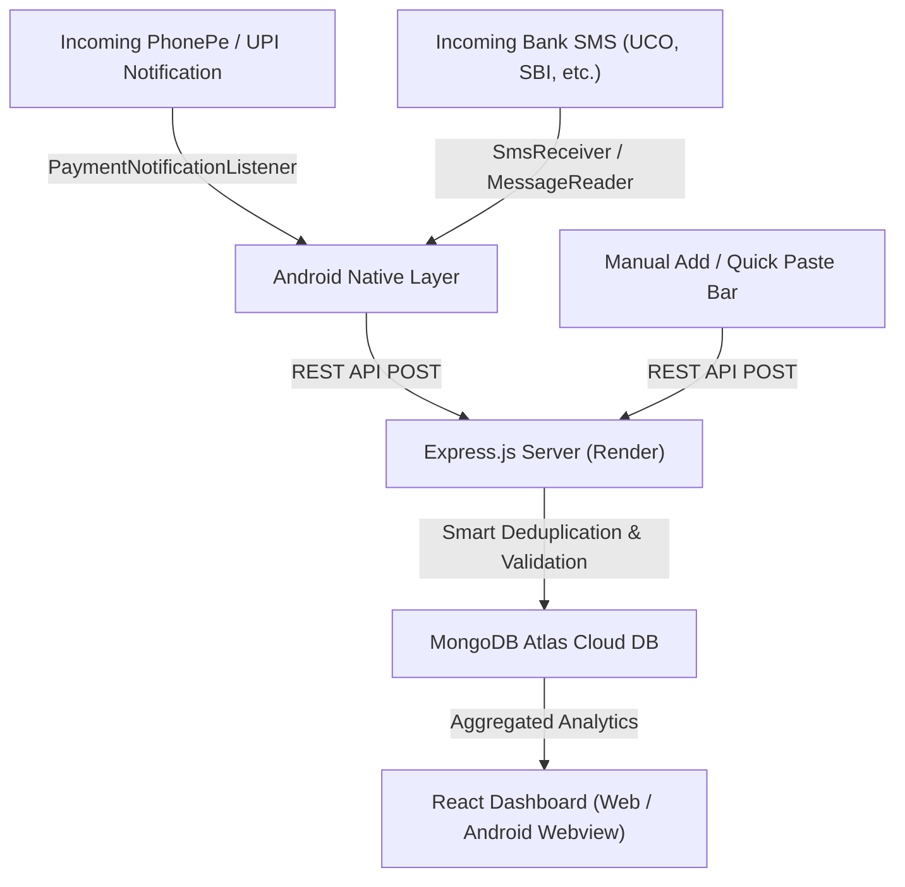

# Spendly — Smart Personal Expense & UPI Tracker

<div align="center">


[](https://react.dev/)
[](https://tailwindcss.com/)
[](https://capacitorjs.com/)
[](https://nodejs.org/)
[](https://www.mongodb.com/atlas)
[](https://spendly-745b.onrender.com)

**Automated, zero-effort expense tracking engineered for Indian digital payments.**  
Ingests and categorizes PhonePe, Google Pay, Paytm, and bank UPI alerts (UCO Bank, SBI, HDFC, ICICI, etc.) with real-time sync, smart cross-source deduplication, and rich interactive analytics.

</div>

---

## 📖 Table of Contents

- [Key Features](#key-features)
- [Architecture & Data Flow](#architecture--data-flow)
- [Project Structure](#project-structure)
- [Core UI Components](#core-ui-components)
- [Technology Stack](#technology-stack)
- [Getting Started (Development Guide)](#getting-started-development-guide)
- [Mobile App Setup & Permissions](#mobile-app-setup--permissions)
- [Database Schema](#database-schema)
- [API Reference](#api-reference)
- [SMS & Notification Parsing Support](#sms--notification-parsing-support)
- [Future Enhancements](#future-enhancements)
- [License](#license)

---

## 🌟 Key Features

### 1. Zero-Manual Automatic Expense Tracking
- **Native Android SMS Interception**: Background `SmsReceiver` catches debits and credits from Indian banks (e.g. UCO Bank, SBI, HDFC, ICICI) the instant an SMS arrives.
- **PhonePe & UPI Push Notification Listener**: Android `NotificationListenerService` captures transaction notifications from PhonePe, Google Pay, and Paytm even when the bank does not trigger an SMS.
- **Historical Inbox Sync**: One-tap native sync reads past bank SMS messages and populates your full expense history.

### 2. Smart Deduplication & Spam Protection
- **10-Minute Cross-Source Window**: When you pay with PhonePe, both a push notification and a bank SMS arrive. Spendly detects matching amounts and timestamps within 10 minutes and links them into a **single transaction** instead of charging you twice.
- **Accurate Credit vs. Debit Logic**: Correctly differentiates peer-to-peer transfers (e.g., _"Money received: GUNJAN has sent ₹160 to your bank account"_ is classified as **INCOME**, not an expense).
- **Promo & Marketing Filter**: Automatically rejects spam (cashback offers, coupons, recharge discounts) so they never pollute your financial data.

### 3. 100% Real-Data Analytics & Dashboard
- **No Mock/Placeholder Data**: All metrics, monthly bars, and donut charts are aggregated dynamically from MongoDB Atlas.
- **Dynamic Metric Cards**: Real-time Total Expenses, Total Income, Daily Average Spend, and PhonePe-specific totals.
- **Interactive Calendar**: Automatically highlights active spending days with exact daily expenditure pills.
- **Category Breakdown**: Automatically categorizes transactions into Food & Dining, Shopping, Transportation, Bills & Utilities, UPI Transfers, and Income.

### 4. Hybrid Web & Native Android Packaging
- Runs seamlessly as a modern web app in the browser and packages into a native Android APK via **Capacitor**.
- Includes runtime permission prompts for SMS and Notification Access upon first launch.
- In-app click-to-edit username with `localStorage` persistence.

---

## 🏗️ Architecture & Data Flow


```mermaid
graph TD
    A["Incoming PhonePe / UPI Notification"] -->|PaymentNotificationListener| C["Android Native Layer"]
    B["Incoming Bank SMS (UCO, SBI, etc.)"] -->|SmsReceiver / MessageReader| C
    C -->|REST API POST| D["Express.js Server (Render)"]
    D -->|Smart Deduplication & Validation| E["MongoDB Atlas Cloud DB"]
    E -->|Aggregated Analytics| F["React Dashboard (Web / Android Webview)"]
    G["Manual Add / Quick Paste Bar"] -->|REST API POST| D
```

---

## 📂 Project Structure

```text
Expense-Tracker/
│
├── Spendly.apk                           # Pre-compiled, installable Android APK (~4MB)
├── Personal_Expenses_Tracker_Guide.docx  # Architecture blueprint & implementation guide
├── package.json                          # Workspace configuration
│
├── backend/                              # Express.js REST API & Database layer
│   ├── config/
│   │   └── db.js                         # Mongoose MongoDB Atlas connection
│   ├── controllers/
│   │   └── transactionController.js      # CRUD, deduplication, promo filter & analytics
│   ├── models/
│   │   └── Transaction.js                # Transaction schema with indexing
│   ├── routes/
│   │   └── transactionRoutes.js          # API endpoints (/transactions, /analytics, /cleanup)
│   ├── .env                              # Port & live MongoDB connection URI
│   ├── package.json                      # Backend dependencies (express, mongoose, cors, dotenv)
│   └── server.js                         # Express entrypoint with status landing page
│
└── frontend/                             # React 19 + Tailwind CSS + Capacitor Android
    ├── android/                          # Native Android Studio project
    │   └── app/src/main/
    │       ├── AndroidManifest.xml       # SMS & Notification Listener declarations
    │       └── java/.../expensetracker/
    │           ├── MainActivity.java     # Permission handlers & Capacitor bridge
    │           ├── SmsReceiver.java      # Background broadcast receiver for bank SMS
    │           └── PaymentNotificationListener.java # Background push notification listener
    ├── src/
    │   ├── components/
    │   │   ├── AddExpenseModal.jsx       # Manual expense entry form
    │   │   ├── CalendarCard.jsx          # Interactive monthly calendar with spend highlights
    │   │   ├── CategoryDonut.jsx         # Visual category breakdown donut
    │   │   ├── Dashboard.jsx             # Main dashboard container
    │   │   ├── Header.jsx                # Date, editable username, sync & export triggers
    │   │   ├── MetricCards.jsx           # Total Expense, Income, Daily Avg, PhonePe cards
    │   │   ├── MobileNav.jsx             # Bottom navigation for mobile screens
    │   │   ├── Sidebar.jsx               # Desktop navigation & branding
    │   │   ├── SmsSyncModal.jsx          # Device SMS sync & manual tester modal
    │   │   ├── SpendingChart.jsx         # Monthly expense breakdown bar chart
    │   │   └── TransactionList.jsx       # Real-time transaction history with delete
    │   ├── services/
    │   │   ├── api.js                    # REST API client
    │   │   ├── db.js                     # Local database interface
    │   │   ├── parser.js                 # SMS and UPI string parser
    │   │   └── smsService.js             # Capacitor native SMS reader interface
    │   ├── utils/
    │   │   └── parser.js                 # Helper utility functions for parsing
    │   ├── App.jsx                       # Main dashboard state & auto-sync loop
    │   └── main.jsx                      # React application bootstrap
    ├── capacitor.config.json             # Capacitor app ID & web asset config
    ├── tailwind.config.js                # Custom palette & neo-morphic styles
    └── vite.config.js                    # Vite bundler configuration
```

---

## 🎨 Core UI Components

The `frontend/src/components` directory houses the modular UI sections of the application:
- **`Header.jsx` & `Sidebar.jsx`**: Handles application navigation, user profile editing, and top-level actionable items (sync triggers).
- **`Dashboard.jsx`**: The main view combining the overview metrics, charts, and calendar.
- **`MetricCards.jsx`**: Displays vital statistics (total expenses, daily averages, specific gateway totals).
- **`SpendingChart.jsx` & `CategoryDonut.jsx`**: Visual data representations leveraging charting libraries for easy consumption.
- **`TransactionList.jsx`**: A chronologically ordered, highly interactive list of all parsed transactions.
- **`SmsSyncModal.jsx` & `AddExpenseModal.jsx`**: Modal dialogs for manual interventions, testing the parser, and managing bulk imports.

---

## 💻 Technology Stack

| Layer                  | Technology                                                               |
| :--------------------- | :----------------------------------------------------------------------- |
| **Frontend Framework** | React 19, Vite 8                                                         |
| **Styling & UI**       | Tailwind CSS v3, Lucide Icons, Canvas Confetti                           |
| **Mobile Runtime**     | Capacitor 6 (`@capacitor/android`, `@solimanware/capacitor-sms-reader`)  |
| **Native Android**     | Java, Android SDK 34, `NotificationListenerService`, `BroadcastReceiver` |
| **Backend Framework**  | Node.js, Express.js 5                                                    |
| **Database**           | MongoDB Atlas (Mongoose ODM)                                             |
| **Deployment**         | Render (Web Service), GitHub Actions                                     |

---

## 🚀 Getting Started (Development Guide)

### Prerequisites
- **Node.js**: v18.0.0 or higher
- **Java Development Kit (JDK)**: JDK 17 or Android Studio JBR
- **Android Studio**: (Only required if compiling native code or running on emulator)
- **MongoDB Atlas Account**: (Or local MongoDB instance)

### 1. Backend Setup

```bash
cd backend
npm install
```

Create or verify `backend/.env` with the following variables:
```env
PORT=5000
MONGODB_URI=your_mongodb_connection_string
```

Run the backend locally:
```bash
npm start
```
*(Runs by default on http://localhost:5000)*

### 2. Frontend Setup

```bash
cd frontend
npm install
```

Create `frontend/.env` to configure your API URL:
```env
# For local backend:
VITE_API_URL=http://localhost:5000/api
# Or point to the cloud server:
# VITE_API_URL=https://spendly-745b.onrender.com/api
```

Start the Vite development server:
```bash
npm run dev
```
*(Runs by default on http://localhost:5173)*

### 3. Android Mobile Build & USB Debugging

#### Option A: Direct Install Pre-compiled APK
If your phone is connected via USB with **USB Debugging** enabled:
```powershell
adb install -r Spendly.apk
```

#### Option B: Compile from Source
```powershell
cd frontend
# 1. Build web production bundle and copy to Android assets
npm run build
npx cap copy android

# 2. Compile debug APK using Gradle
cd android
.\gradlew.bat assembleDebug

# 3. Output APK location:
# frontend/android/app/build/outputs/apk/debug/app-debug.apk
```

#### Option C: Open in Android Studio
```bash
cd frontend
npx cap open android
```
Select your physical phone or emulator in Android Studio and click the green **Run (▶)** button.

---

## 📱 Mobile App Setup & Permissions

For automated background tracking to operate on Android devices:

1. **SMS Permission**:
   - On first launch, tap **Allow** on the Android system dialog (_"Allow Spendly to send and view SMS messages"_).
2. **Notification Access (For PhonePe/GPay Push Notifications)**:
   - When prompted, grant **Notification Access** to **Spendly** in Android Settings. This enables `PaymentNotificationListener` to catch PhonePe alerts in real time without waiting for an SMS.
3. **Battery Optimization**:
   - For uninterrupted background tracking on devices running MIUI / ColorOS / OxygenOS / OneUI, set Spendly's battery usage to **"Unrestricted / Don't optimize"**.

---

## 🗄️ Database Schema

The `Transaction` model (located in `backend/models/Transaction.js`) structures data as follows:

- **amount** `(Number)`: The transaction value.
- **type** `(String)`: Enum: `['expense', 'income']`.
- **category** `(String)`: E.g., `Food & Dining`, `UPI Transfers`.
- **date** `(Date)`: The extracted or synchronized timestamp.
- **source** `(String)`: Enum: `['sms', 'notification', 'manual']`.
- **sender** `(String)`: The identified sender/bank (e.g., `SBI`, `PhonePe`).
- **description** `(String)`: Raw snippet or user description.
- **hash** `(String)`: A unique cryptographic hash generated from `amount`, `date`, and `type` to facilitate smart deduplication.

---

## 🌐 API Reference

Live Base URL: `https://spendly-745b.onrender.com`

| Method   | Endpoint                    | Description                                                |
| :------- | :-------------------------- | :--------------------------------------------------------- |
| `GET`    | `/`                         | API status landing page                                    |
| `GET`    | `/api/health`               | Service health status and database connectivity            |
| `GET`    | `/api/transactions`         | Retrieve all transactions ordered by date                  |
| `POST`   | `/api/transactions`         | Create a transaction with automated deduplication          |
| `POST`   | `/api/transactions/batch`   | Bulk insert transactions (used by native sync)             |
| `DELETE` | `/api/transactions/:id`     | Delete a single transaction by ID                          |
| `DELETE` | `/api/transactions`         | Clear all transaction history                              |
| `GET`    | `/api/analytics`            | Aggregated metrics (totals, monthly trend, category share) |
| `POST`   | `/api/transactions/cleanup` | Trigger database deduplication and spam purge              |

---

## 🧠 SMS & Notification Parsing Support

Spendly's parsing engine (`frontend/src/services/parser.js`) is fine-tuned for Indian banking formats:
- **Bank SMS Formats**: UCO Bank, State Bank of India (SBI), HDFC Bank, ICICI Bank, Axis Bank, Bank of Baroda, Punjab National Bank.
- **UPI Apps**: PhonePe (`com.phonepe.app`), Google Pay (`com.google.android.apps.nbu.paisa.user`), Paytm (`net.one97.paytm`).
- **Supported Currency Formats**: `Rs.`, `Rs`, `₹`, `INR` (with comma separators and decimals).
- **Supported Date Formats**: `DD-MM-YYYY`, `DD/MM/YYYY`, `DD-Mon-YYYY`.
- **Balance Extraction**: Automatically captures and tracks available account balances (`Avl Bal Rs.XX.XX`).

---

## 🔮 Future Enhancements
- **Multi-user Support**: Implementing User Authentication (JWT) and User-specific database isolation.
- **Budgeting Alerts**: Define monthly category caps with push notification warnings.
- **Export to CSV/PDF**: Generate comprehensive financial reports directly from the dashboard.
- **Advanced Machine Learning Parsing**: Transitioning from regex-based to lightweight ML models for zero-configuration support of new bank formats.

---

## 📜 License

This project is licensed under the **MIT License** — feel free to use and customize for personal or commercial expense tracking projects.
